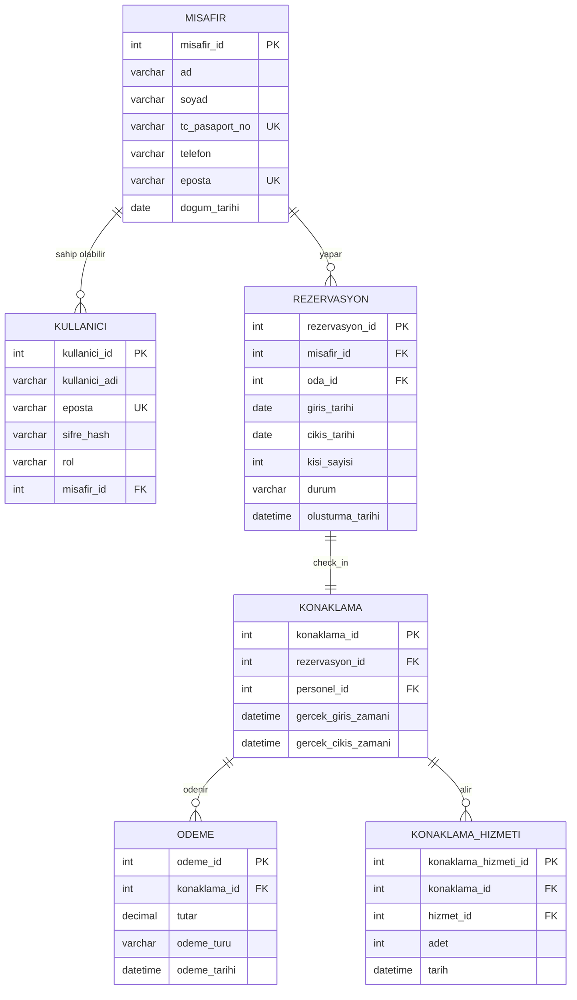

```mermaid
erDiagram
    MISAFIR ||--o{ KULLANICI : "sahip olabilir"
    MISAFIR ||--o{ REZERVASYON : "yapar"
    REZERVASYON ||--|| KONAKLAMA : "check_in"
    KONAKLAMA ||--o{ ODEME : "odenir"
    KONAKLAMA ||--o{ KONAKLAMA_HIZMETI : "alir"

    MISAFIR {
        int misafir_id PK
        varchar ad
        varchar soyad
        varchar tc_pasaport_no UK
        varchar telefon
        varchar eposta UK
        date dogum_tarihi
    }

    KULLANICI {
        int kullanici_id PK
        varchar kullanici_adi
        varchar eposta UK
        varchar sifre_hash
        varchar rol
        int misafir_id FK
    }

    REZERVASYON {
        int rezervasyon_id PK
        int misafir_id FK
        int oda_id FK
        date giris_tarihi
        date cikis_tarihi
        int kisi_sayisi
        varchar durum
        datetime olusturma_tarihi
    }

    KONAKLAMA {
        int konaklama_id PK
        int rezervasyon_id FK
        int personel_id FK
        datetime gercek_giris_zamani
        datetime gercek_cikis_zamani
    }

    ODEME {
        int odeme_id PK
        int konaklama_id FK
        decimal tutar
        varchar odeme_turu
        datetime odeme_tarihi
    }

    KONAKLAMA_HIZMETI {
        int konaklama_hizmeti_id PK
        int konaklama_id FK
        int hizmet_id FK
        int adet
        datetime tarih
    }
```
