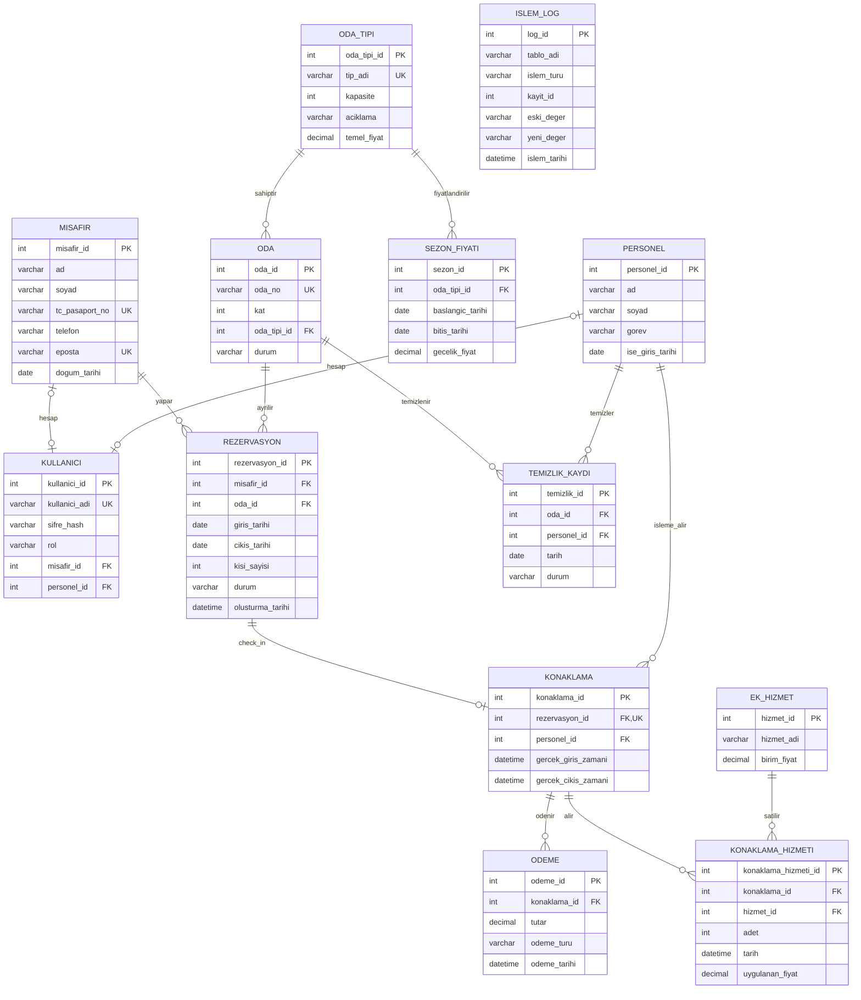

```mermaid
erDiagram
    MISAFIR |o--o| KULLANICI : "hesap"
    MISAFIR ||--o{ REZERVASYON : "yapar"
    REZERVASYON ||--o| KONAKLAMA : "check_in"
    KONAKLAMA ||--o{ ODEME : "odenir"
    KONAKLAMA ||--o{ KONAKLAMA_HIZMETI : "alir"
   ODA_TIPI ||--o{ ODA : "sahiptir"
     ODA_TIPI  ||--o{ SEZON_FIYATI : "fiyatlandirilir"
     ODA     ||--o{ REZERVASYON : "ayrilir"
     ODA      ||--o{ TEMIZLIK_KAYDI: "temizlenir"
     PERSONEL |o--o| KULLANICI: "hesap"
     PERSONEL ||--o{ KONAKLAMA: "isleme_alir"
     PERSONEL ||--o{ TEMIZLIK_KAYDI: "temizler"
     EK_HIZMET ||--o{ KONAKLAMA_HIZMETI: "satilir"

    MISAFIR {
        int misafir_id PK
        varchar ad
        varchar soyad
        varchar tc_pasaport_no UK
        varchar telefon
        varchar eposta UK
        date dogum_tarihi
    }

    KULLANICI {
        int kullanici_id PK
        varchar kullanici_adi UK
        varchar sifre_hash
        varchar rol
        int misafir_id FK
        int personel_id FK

    }

    REZERVASYON {
        int rezervasyon_id PK
        int misafir_id FK
        int oda_id FK
        date giris_tarihi
        date cikis_tarihi
        int kisi_sayisi
        varchar durum
        datetime olusturma_tarihi
    }

    KONAKLAMA {
        int konaklama_id PK
        int rezervasyon_id FK,UK
        int personel_id FK
        datetime gercek_giris_zamani
        datetime gercek_cikis_zamani
    }

    ODEME {
        int odeme_id PK
        int konaklama_id FK
        decimal tutar
        varchar odeme_turu
        datetime odeme_tarihi
    }

    KONAKLAMA_HIZMETI {
        int konaklama_hizmeti_id PK
        int konaklama_id FK
        int hizmet_id FK
        int adet
        datetime tarih
        decimal uygulanan_fiyat
    }

    ODA_TIPI {
        int oda_tipi_id PK
        varchar tip_adi UK
        int kapasite
        varchar aciklama 
        decimal temel_fiyat
    }
    ODA{
        int oda_id PK
        varchar oda_no UK
        int kat 
        int oda_tipi_id FK
        varchar durum 
    }
    SEZON_FIYATI {
        int sezon_id PK
        int oda_tipi_id FK
        date baslangic_tarihi
        date bitis_tarihi 
        decimal gecelik_fiyat
    }
    PERSONEL {
        int personel_id PK
        varchar ad 
        varchar soyad
        varchar gorev 
        date ise_giris_tarihi 

    }
    EK_HIZMET {
        int hizmet_id PK
        varchar hizmet_adi
        decimal birim_fiyat 
    }
    TEMIZLIK_KAYDI {
        int temizlik_id PK
        int oda_id FK
        int personel_id FK
        date tarih 
        varchar durum 
    }
    ISLEM_LOG{
        int log_id PK
        varchar tablo_adi 
        varchar islem_turu 
        int kayit_id
        varchar eski_deger
        varchar yeni_deger
        datetime islem_tarihi 
    }
```

   
